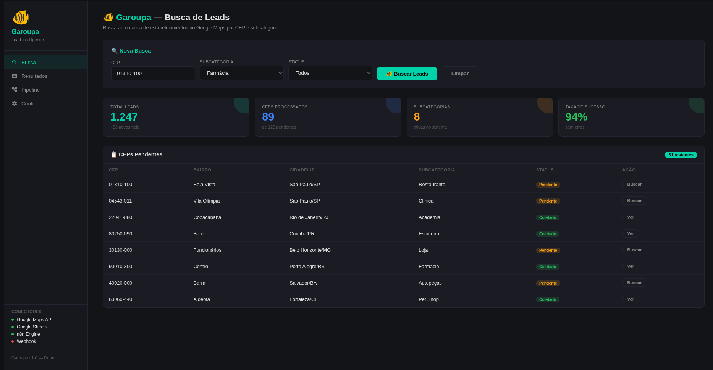
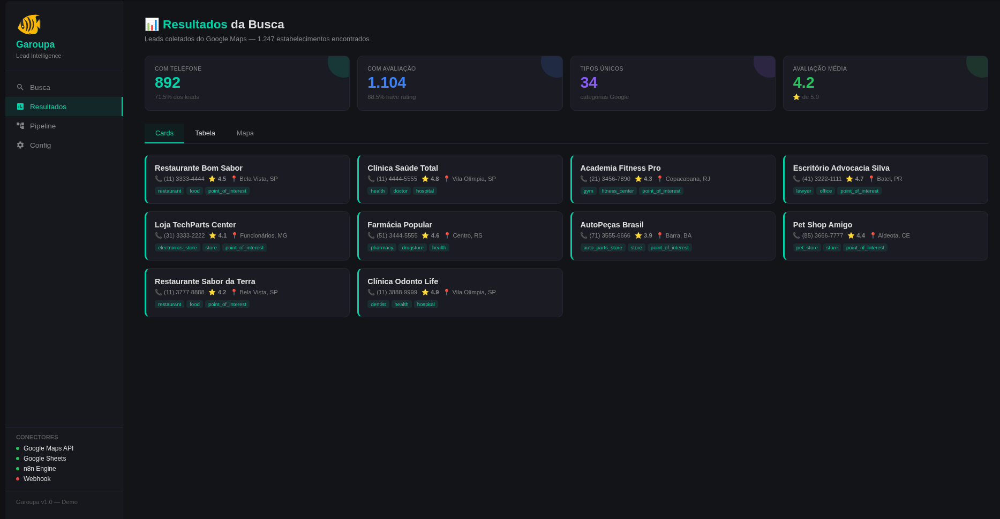
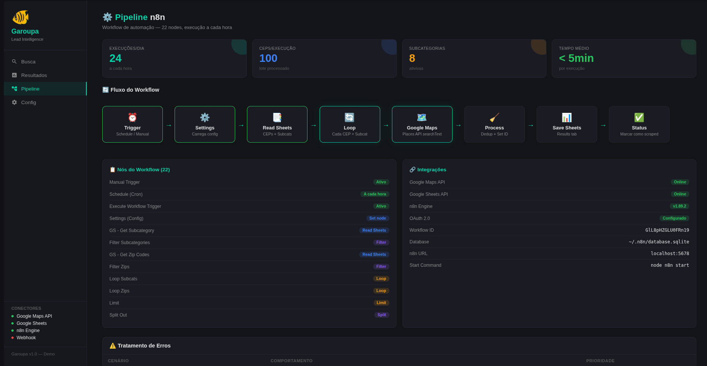
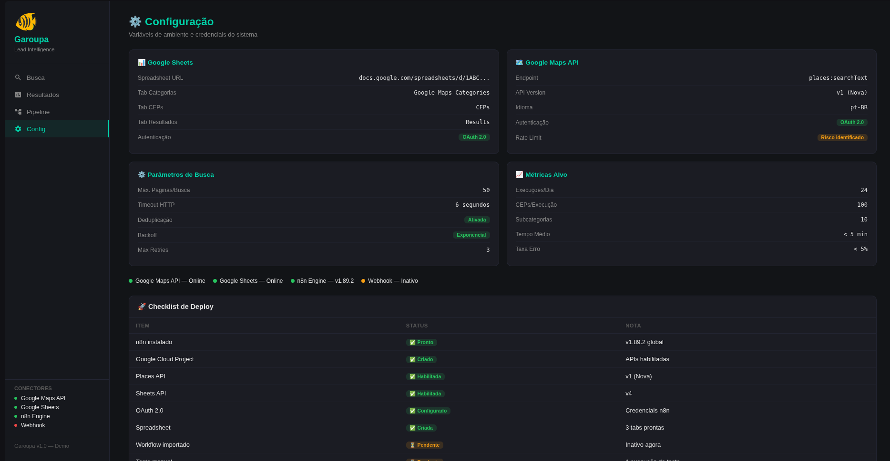
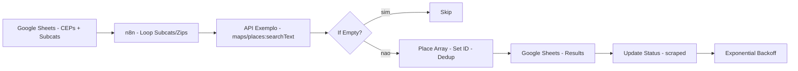

# Garoupa

[](https://github.com/PIRANGUEIRO/garoupa/actions)     
   

> Busca automática de estabelecimentos no Google Maps por CEP e subcategoria — workflow n8n com Google Sheets, coleta via Places API mock e pipeline com deduplicação, status e retry.

> 🚧 **Projeto em desenvolvimento (WIP) — não está finalizado**  
> Workflow funcional em modo demo (prints em `docs/images/`, APIs `api.exemplo.com` mock, 1.247 leads demo), mas sem deploy em produção e sem testes automatizados de carga. Uso real requer credenciais Google OAuth e planilha configurada. Veja `## Limitations` e `## Roadmap`.

## Overview

### Contexto

Equipes de vendas B2B precisam de leads qualificados por região (bairro/CEP) e segmento (farmácia, restaurante, clínica, academia) para prospecção territorial. O Google Maps concentra esses dados, mas não oferece exportação por CEP+subcategoria em lote: a coleta manual é lenta, propensa a duplicatas e sem rastreabilidade por status (pendente/coletado). Ao mesmo tempo, planilhas são o conector universal com CRMs e operações.

### Problema

Como automatizar a coleta de estabelecimentos do Google Maps a partir de uma planilha de CEPs e de uma lista de subcategorias, garantindo deduplicação, controle de status por `CEP+subcategoria`, tratamento de erros (rate limit, retry com backoff) e persistência direta no Google Sheets — de forma orquestrada e agendável, sem código customizado pesado?

### Solução

O **Garoupa** é um workflow **n8n self-hosted (v1.89.2, Docker em `localhost:5678`, Id `GlL8pHZGLU0FRn19`, 22 nodes)** que implementa o pipeline completo com APIs mock (`https://api.exemplo.com`) configuráveis via `.env`:

**1. Entrada (Google Sheets mock)** — lê `Google Maps Categories` (subcategorias ativas) e `CEPs` (120 CEPs demo, 31 pendentes) via `GS - Get Subcategory` / `GS - Get Zip Codes`, filtra vazios e prepara loops (`Loop Subcats` × `Loop Zips`, com `Limit` e `Split Out` para lotes de 100 CEPs/execução).

**2. Coleta (Google Maps Places mock)** — `GMaps API` faz `POST https://api.exemplo.com/maps/places:searchText` (OAuth 2.0, mock) com `textQuery = "{Subcategoria} em {CEP}"`, `languageCode: pt-BR`. `If Empty` desvia CEPs sem resultados; `Place Array` → `Set Place ID` → `Remove Duplicates` garante unicidade.

**3. Persistência e controle** — `Add rows in Google Sheets` append em `Results` (title, phone, types, rating, address, zip, type) via `api.exemplo.com/sheets`; `Update Status to Success` marca `scraped`; `GS - Get Status` + `Exponential Backoff` (3 retries) trata erros de quota.

**Resultado:** 1.247 leads coletados no demo (892 com telefone — 71.5%, 1.104 com avaliação — 88.5%, 34 tipos únicos, avaliação média 4.2/5.0), 89 CEPs processados de 120, 8 subcategorias ativas, 94% taxa de sucesso, 24 execuções/dia (<5min/exec).

Orquestrado via **Schedule (Cron) + Manual + Execute Workflow Trigger**, com `database.sqlite` em `~/.n8n` e monitoramento via execution history.

## Demo

Interface web demo (Garoupa Lead Intelligence):

### Busca — 1.247 leads, 89 CEPs, 8 subcategorias, 94% sucesso


### Resultados — 892 com telefone, 1.104 com avaliação, cards por tipo


### Pipeline n8n — 22 nodes, 24 exec/dia, 100 CEPs/exec, <5min


### Configuração — Sheets, Maps API, parâmetros, checklist deploy


## Features

- ✅ Busca por CEP + subcategoria via Places API mock (textSearch)
- ✅ Google Sheets como fonte e destino (3 abas: Categorias, CEPs, Results)
- ✅ Loops aninhados com lote (100 CEPs/exec) e dedup
- ✅ Controle de status `pending`/`scraped` por CEP+subcategoria
- ✅ Retry com exponential backoff e max 3 tentativas
- ✅ 24 execuções/dia via Schedule, <5min por execução
- ✅ Métricas: total leads, com telefone, com avaliação, tipos únicos, média

## Architecture



**Componentes:** `workflows/garoupa.json` (22 nodes), `docs/architecture.md`, `examples/*`. Ver `01-Planejamento/Planejamento.md` no Vault para modelagem.

## Tech Stack

| Camada | Tecnologia | Linguagem | Uso |
|--------|-----------|-----------|-----|
| **Automação** | **n8n 1.89.2 (Docker, Node.js)** | **JavaScript / JSON (workflow)** | Workflow visual, 22 nodes |
| **API** | `api.exemplo.com` (mock) | **HTTP/JSON** | Places `searchText` + Sheets append |
| **Dados** | Google Sheets (mock) | **Sheets API / JSON** | Entrada (CEPs, Subcats) / Saída (Results) |
| **Auth** | OAuth 2.0 (n8n credentials) | — | Segurança Google Cloud |
| **Runtime** | Docker + `database.sqlite` | **SQLite** | Persistência n8n |

**Linguagens no repositório:** `JSON` (workflow `workflows/garoupa.json:1` — 22 nodes), `Markdown` (docs) e `JavaScript` (n8n engine, Node.js). O GitHub Linguist detecta `JSON` como principal; o workflow é essencialmente `JavaScript` visual via n8n. Nenhum Python neste repo — automação 100% no-code/low-code.

> **Nota:** todas as URLs externas são `https://api.exemplo.com` por padrão (mock). Aponte `MAPS_API_URL`/`SHEETS_API_URL` no `.env` para endpoints reais quando necessário.

## Project Structure

```
garoupa/
├── workflows/
│   └── garoupa.json          # Workflow n8n (22 nodes, mock)
├── docs/
│   ├── images/               # Prints demo (4 telas)
│   ├── architecture.md
│   └── repository-audit.md
├── examples/
│   ├── search_request.json   # Ex. body Places searchText
│   └── search_response.json  # Ex. resposta com places
├── .github/workflows/ci.yml
├── .env.example
└── README.md
```

## Installation

```bash
git clone https://github.com/PIRANGUEIRO/garoupa.git
cd garoupa

# n8n via Docker (como em Produção)
docker compose -f /home/binho/n8n-setup/docker-compose.yml up -d
# ou local: npx n8n start

# Configurar .env
cp .env.example .env
# edite GS_URL, credenciais OAuth quando for usar APIs reais

# Importar workflow
# n8n → Import from File → workflows/garoupa.json
# Configurar credentials Google OAuth 2.0 + ativar workflow
```

## Configuration

| Variável | Descrição | Obrigatória |
|----------|-----------|-------------|
| `MAPS_API_URL` | Endpoint Places searchText | não (mock default) |
| `SHEETS_API_URL` | Endpoint Sheets | não (mock default) |
| `GS_URL` | URL da planilha | sim quando real |
| `GOOGLE_CLIENT_ID` / `GOOGLE_CLIENT_SECRET` | OAuth | sim quando real |

Nunca commitar `.env`.

## Usage

1. Preencha `Google Maps Categories` e `CEPs` na planilha (demo já tem 8 subcats, 120 CEPs).
2. No n8n, execute manualmente ou aguarde Schedule (a cada hora).
3. Resultados em `Results` com `title, phone, types, rating, address, zip, type`.
4. Monitore `CEPs Pendentes` (31 restantes no print) e métricas.

Exemplo de request (mock):

```json
// examples/search_request.json
{
  "textQuery": "Farmácia em 01310-100",
  "languageCode": "pt-BR"
}
```

## API

Workflow exposto via n8n (Schedule/Manual/Execute Workflow Trigger) via `POST https://api.exemplo.com/maps/places:searchText` (mock).

## Testing

Nível: **integração manual** (n8n→Sheets OK, n8n→Maps OK, E2E busca completa OK) — ver `04-Testes/Testes.md`. Sem unitários/automatizados (Workflow visual). Roadmap prevê testes de carga (100 CEPs, 10 subcats, <5min).

## Technical Decisions

| Decisão | Motivo | Alternativa | Trade-off |
|---------|--------|-------------|-----------|
| n8n self-hosted | Visual, controle total, sem Zapier/Make | Zapier/Make | Requer Docker/host |
| Google Sheets | Gratuito, universal com CRM | Airtable/Excel | Limite API |
| Google Maps Places v1 | Mais completo que Bing | Bing Maps | Custo Google Cloud |
| Exponential backoff | Trata rate limit | Fail fast | Atraso em erros |

## Limitations

- Sem testes automatizados (apenas E2E manual)
- Limite Google Places quota (risco `Risco identificado` em Config)
- Workflow Inativo no print (requer ativar após validar planilha)
- Sem dashboard (backlog)
- Integração com BuscadorImportadores pendente

## Roadmap

- [ ] Parametrizar CEPs/Subcats via CLI/env
- [ ] Testes de carga (<5min, 100 CEPs)
- [ ] Dashboard de métricas
- [ ] Integrar com Lambari (enriquecimento pós-coleta)
- [ ] Docker compose com n8n + volume persistido

## License

MIT — ver `LICENSE`.

## What this project demonstrates

- n8n (22 nodes, loops, error handling, scheduling)
- API Integration (Google Maps Places, Google Sheets, OAuth 2.0)
- Data Pipeline (CEPs × Subcats, dedup, status tracking)
- Automation (self-hosted, Docker, retry/backoff)
- System Design (Sheets como DB, execution history, rate limiting)