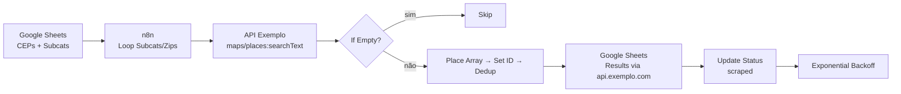

# Architecture — Garoupa

## Overview
Workflow n8n de coleta de leads do Google Maps via Places API mock.

## Fluxo

## Nodes (22)
Ver `workflows/garoupa.json` e `README > Pipeline`.

## Dependências externas (mock)
- `api.exemplo.com/maps/places:searchText` (mock configurável via `MAPS_API_URL`)
- `api.exemplo.com/sheets` (mock configurável via `SHEETS_API_URL`)
Configuráveis via `.env` (`MAPS_API_URL`, `SHEETS_API_URL`).

## Persistência
- Google Sheets (mock) — 3 abas: Categorias, CEPs, Results
- Status por CEP+subcategoria (`pending`/`scraped`)
- n8n `database.sqlite` (~/.n8n) quando real

## Tratamento de falhas
- `If Empty` pula CEPs sem resultados
- `Remove Duplicates` evita repetição
- `Exponential Backoff` + `Check Max Retries` (3) para rate limit
- Schedule a cada hora (24 exec/dia, 100 CEPs/exec, ~5min/exec)
